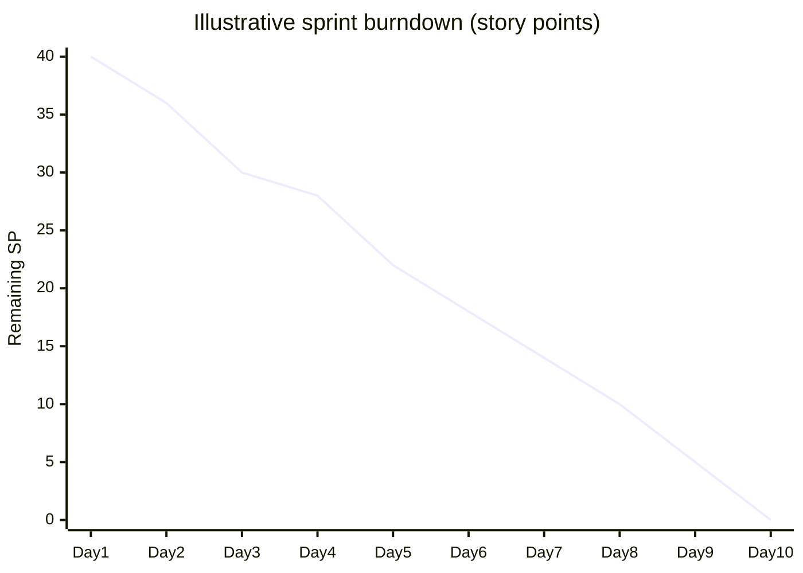
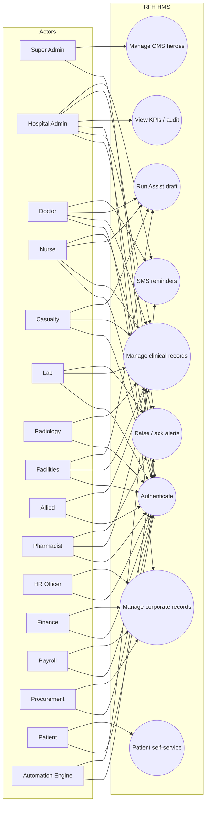
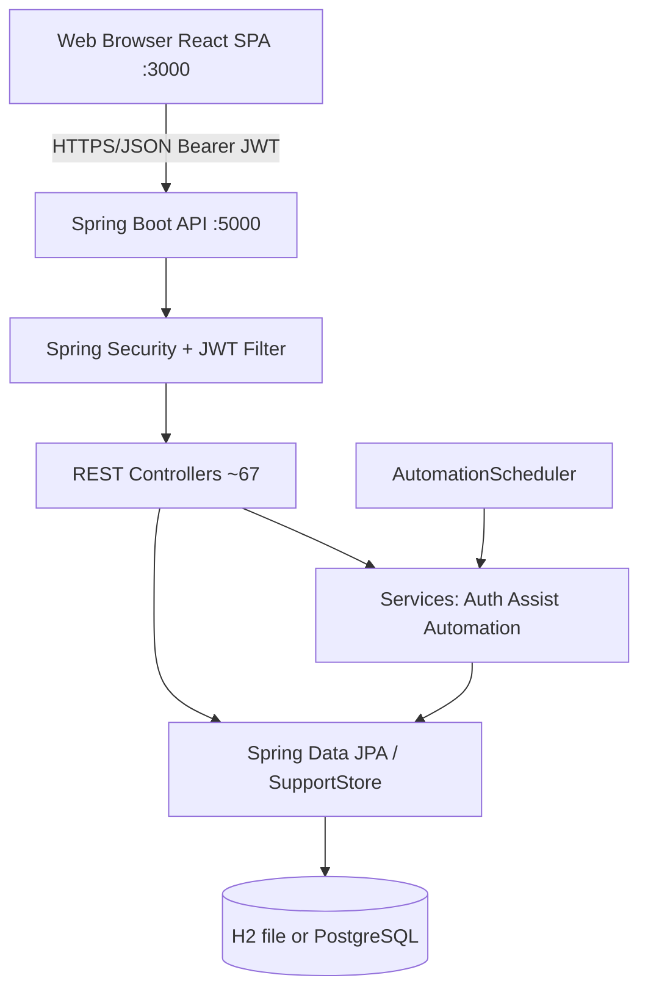
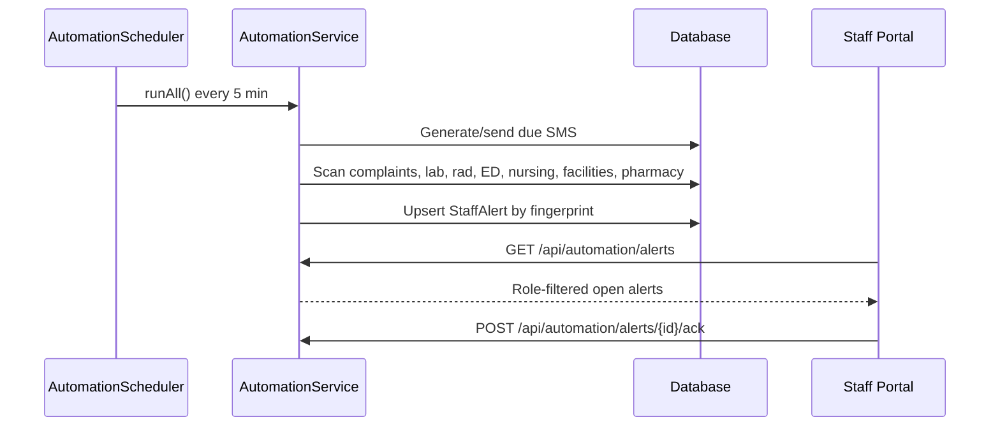
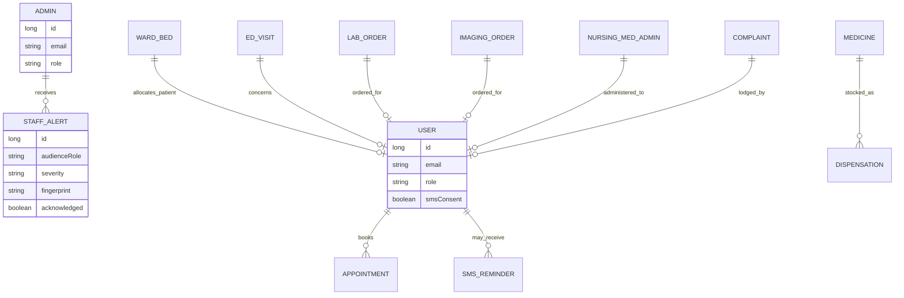
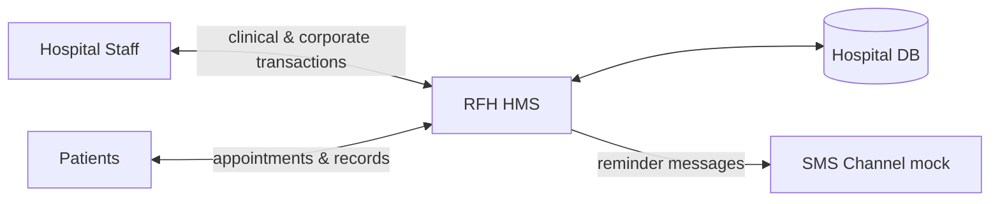

# Rob Ferreira Hospital Management System (RFH HMS)

## Full Project Documentation

| Field | Value |
|---|---|
| **Document title** | RFH HMS — Project Documentation Pack |
| **System name** | Rob Ferreira Hospital Management System |
| **Organisation** | Rob Ferreira Hospital (conceptual tertiary facility), Mbombela, Mpumalanga, South Africa |
| **Programme alignment** | Provincial **#OperationAsiphileni** turnaround programme |
| **Document type** | Combined Project Plan, Software Requirements Specification (SRS), Design Specification, Agile Process Record |
| **SRS basis** | IEEE Std 830-1998 recommended practice for Software Requirements Specifications |
| **Process framework** | Agile — Scrum (Schwaber & Sutherland, 2020) |
| **Version** | 1.0 |
| **Status** | Working baseline for academic / institutional submission |
| **Last updated** | September 2026 |
| **Related artefacts** | [`README.md`](../README.md), [`MODULES.md`](MODULES.md), [`TRAINING_CHECKLIST.md`](TRAINING_CHECKLIST.md), [`OPS_POSTGRES.md`](OPS_POSTGRES.md) |

---

## Abstract

This document describes the planning, requirements, design, Agile delivery approach, and scholarly context for the **Rob Ferreira Hospital Management System (RFH HMS)** — a web-based hospital information system (HIS) supporting clinical, administrative, financial, and governance workflows for a tertiary public hospital setting in Mpumalanga. The system is implemented as a React single-page application and a Spring Boot REST API with JWT authentication, role-based portals, operational automation, and rule-based clinical/ops Assist drafts.

The documentation follows standard software engineering practice: literature-informed problem framing; Agile/Scrum planning; an IEEE 830-structured SRS; UML-style diagrams (use case, architecture, sequence, data overview); and implementation notes. References are drawn from Google Scholar–indexed and peer-accessible sources on hospital information systems, South African EHR challenges, Agile in healthcare IT, and requirements engineering standards.

**Keywords:** hospital information system; electronic health record; Agile; Scrum; IEEE 830; UML use case; South Africa; Mpumalanga; Operation Asiphileni.

---

## Table of contents

1. [Introduction](#1-introduction)  
2. [Literature review](#2-literature-review)  
3. [Project planning](#3-project-planning)  
4. [Agile methodology](#4-agile-methodology)  
5. [Software Requirements Specification (SRS)](#5-software-requirements-specification-srs)  
6. [System analysis and design (diagrams)](#6-system-analysis-and-design-diagrams)  
7. [Implementation overview](#7-implementation-overview)  
8. [Verification and validation](#8-verification-and-validation)  
9. [Conclusions and future work](#9-conclusions-and-future-work)  
10. [References](#10-references)  
11. [Appendices](#11-appendices)

---

## 1. Introduction

### 1.1 Purpose of this document

This pack serves as the **master technical and academic documentation** for RFH HMS. It is intended for:

- Academic assessors and supervisors (capstone / research project submission)
- Hospital ICT and clinical stakeholders reviewing scope and roles
- Developers maintaining or extending the codebase
- Auditors assessing control, privacy, and governance alignment

### 1.2 Problem statement

Public hospitals manage high volumes of clinical and administrative data across fragmented tools (paper files, spreadsheets, and multiple departmental systems). South African literature highlights fragmented EHR adoption, interoperability gaps, and continued paper-based practice in many facilities (Katurura & Cilliers, 2018). Tertiary centres such as Rob Ferreira Hospital additionally face provincial turnaround pressures under programmes such as **#OperationAsiphileni**, spanning infrastructure, HR, finance, patient experience, and monitoring.

Without an integrated digital platform, facilities experience:

- Delayed access to ward, ED, laboratory, and pharmacy status
- Weak visibility of complaints SLA and theatre utilisation
- Manual procurement / payroll / HR processes with limited auditability
- Limited automation for reminders and operational escalations

### 1.3 Project aim and objectives

**Aim:** Design and implement a role-based hospital management web system that supports whole-hospital staff workflows and patient self-service, aligned to Asiphileni pillars.

**Objectives:**

1. Elicit and specify functional and non-functional requirements using IEEE 830 guidance.  
2. Deliver iteratively using Scrum (product backlog, sprints, increments).  
3. Provide authenticated portals for clinical, support, governance, and patient actors.  
4. Implement automation (SMS, SLA/TAT alerts) and Assist draft helpers with human confirmation.  
5. Document architecture, use cases, and verification procedures.

### 1.4 Scope

**In scope**

- Staff login and role-gated portals (admin, doctor, nurse, casualty, lab, radiology, facilities, allied, pharmacy, HR, finance, payroll, procurement, patient, CMS)
- Clinical operations: beds/vitals/meds/handovers; ED visits; lab/imaging orders; allied referrals; doctor consult and queue
- Governance: complaints SLA, SMS reminders, audit trail, monitoring KPIs, reporting exports
- Corporate: HR, finance, payroll, procurement modules
- Automation alerts and Assist API
- Local H2 persistence with optional PostgreSQL profile

**Out of scope (current baseline)**

- Live LLM vendor integration (Assist is rule-based with upgrade path)
- Full HL7/FHIR national interoperability
- Production SMS gateway (mock/simulated send)
- Native mobile applications
- Medical device control systems

### 1.5 System overview

| Layer | Technology |
|---|---|
| Frontend | React 18.3, React Router 6, Tailwind CSS, Create React App |
| Backend | Spring Boot 4.0, Java 21, Spring Security, Spring Data JPA |
| Auth | JWT (JJWT 0.12.6), role claims |
| Database | H2 file (default); PostgreSQL optional |
| Ports | API `5000`, UI `3000` |

---

## 2. Literature review

### 2.1 Hospital information systems

A hospital information system (HIS) is a comprehensive, integrated information system designed to manage clinical, administrative, and financial aspects of a hospital. Scholarly work on HIS repeatedly links success to user acceptance, training, infrastructure readiness, and staged implementation rather than “big bang” rollouts (see systematic discussions of HIS success/failure factors in hospital settings indexed on Google Scholar under “hospital information system” evaluation studies).

Haux (2006) and related health-informatics literature frame HIS evolution from departmental systems toward integrated electronic health records supporting care coordination — a framing that motivates RFH HMS’s multi-portal design.

### 2.2 South African EHR / HIS context

Katurura and Cilliers (2018) conducted a systematic literature review of electronic health record systems in South Africa’s public sector. They note that National Health Insurance (NHI) ambitions require patient registration and tracking, while practical barriers include fragmentation across vendor systems, interoperability failures, infrastructure and skills constraints, and extensive residual paper processes. RFH HMS responds at **facility level** by consolidating role-based workflows and auditability, while remaining honest that national FHIR/HPRS integration is future work.

Provincial landscapes historically include diverse HIS products (e.g. PAAB cited for Mpumalanga in South African HIS inventory studies). RFH HMS is positioned as a modern web platform aligned to local turnaround programmes rather than a claim to replace provincial systems overnight.

### 2.3 Requirements engineering for healthcare software

IEEE Std 830-1998 defines qualities of a good SRS: correctness, unambiguity, completeness, consistency, ranking/stability, verifiability, modifiability, and traceability (IEEE, 1998). Healthcare software additionally needs explicit privacy, safety, and role constraints. Recent maturity-oriented work on software requirements engineering for healthcare information systems emphasises structured RE processes and critical success factors for HIS projects (Akbar et al., 2022).

### 2.4 Agile and Scrum in healthcare IT

Rigid waterfall approaches are frequently associated with delayed HIS projects. Case evidence shows Scrum improving collaboration, responsiveness to changing clinical requirements, and delivery efficiency in hospital information system development (Santoso et al., 2025). Similar Scrum applications appear in healthcare information platforms and hospital sub-systems such as preadmission and remuneration systems (e.g. Vidyamedic Scrum delivery; Scrum at RSUD Raden Mattaher; Sint Carolus preadmission Scrum study).

The Scrum Guide (Schwaber & Sutherland, 2020) defines roles (Product Owner, Scrum Master, Developers), events (Sprint, Planning, Daily Scrum, Review, Retrospective), and artefacts (Product Backlog, Sprint Backlog, Increment). RFH HMS planning in Section 4 maps delivery to these artefacts.

### 2.5 Information systems project success factors

Broader IS research highlights engaged sponsorship, continuous user involvement, and communication as critical success factors (Hughes et al., 2020). RFH HMS therefore uses role-based portals (so each actor sees relevant workflows) and training/checklist artefacts (`docs/TRAINING_CHECKLIST.md`).

### 2.6 Privacy and governance (South Africa)

Although not a Google Scholar paper, the **Protection of Personal Information Act (POPIA)** is the binding South African statute for personal information processing. RFH HMS design assumptions include role-based access, JWT sessions, audit events, and SMS consent flags — consistent with privacy-by-design expectations for health data.

---

## 3. Project planning

### 3.1 Stakeholders

| Stakeholder | Interest |
|---|---|
| Hospital executive / admin | Command centre, KPIs, user provisioning |
| Clinical departments | Nursing, ED, lab, radiology, allied, doctors, pharmacy |
| Corporate services | HR, finance, payroll, procurement, facilities |
| Patients | Appointments, records, notifications, feedback |
| Provincial programme office | Asiphileni pillar alignment and reporting |
| Development team | Deliverable increments, maintainable architecture |
| Academic supervisor | Documentation quality, methodology, evaluation |

### 3.2 Work breakdown structure (WBS)

```text
RFH HMS
├── 1. Initiation & research
│   ├── Literature review (HIS, SA EHR, Agile)
│   ├── Stakeholder & pillar mapping (Asiphileni)
│   └── Tooling setup (Node, JDK 21, Maven)
├── 2. Requirements
│   ├── Actor & use-case modelling
│   ├── Functional requirements (IEEE 830)
│   └── Non-functional requirements (security, performance, POPIA)
├── 3. Design
│   ├── Architecture (SPA + REST API)
│   ├── Data model (JPA entities)
│   └── UI portal chrome / brand system
├── 4. Implementation (Scrum increments)
│   ├── Auth & admin CMS
│   ├── Clinical portals
│   ├── Corporate portals
│   └── Automation & Assist
├── 5. Verification
│   ├── API health & role login tests
│   ├── Build verification (Maven / npm)
│   └── UAT against training checklist
└── 6. Documentation & handover
    ├── README / ops docs
    └── This project documentation pack
```

### 3.3 High-level schedule (illustrative)

| Phase | Duration (indicative) | Milestone |
|---|---|---|
| Initiation & literature | 1–2 weeks | Problem statement approved |
| Requirements & use cases | 2 weeks | SRS baseline v1.0 |
| Architecture spike | 1 week | Stack & security confirmed |
| Sprint 1–2 | 4 weeks | Auth, admin, patient, doctor core |
| Sprint 3–4 | 4 weeks | HR/finance/payroll/procurement/pharmacy |
| Sprint 5–6 | 4 weeks | Nursing/ED/lab/radiology/facilities/allied |
| Sprint 7 | 2 weeks | Automation + Assist |
| Hardening & docs | 2 weeks | Documentation pack + demo |

*Actual calendar dates should be filled by the project team / Product Owner.*

### 3.4 Risk register (excerpt)

| ID | Risk | Likelihood | Impact | Mitigation |
|---|---|---|---|---|
| R1 | Scope creep across hospital departments | High | High | Scrum backlog prioritisation; MVP per portal |
| R2 | Privacy breach of patient data | Medium | Critical | JWT + RBAC; audit; minimise PHI in logs; POPIA consent for SMS |
| R3 | Backend/frontend version skew after pull | Medium | Medium | `npm run dev` + restart API; health check |
| R4 | Over-reliance on Assist drafts | Medium | High | Explicit “suggestion only”; clinician confirmation |
| R5 | H2 file lock / local DB corruption | Low | Medium | Postgres profile for shared environments |

### 3.5 Budget / resource assumptions

| Resource | Assumption |
|---|---|
| Developers | Small Scrum team (1–5) |
| Product Owner | Hospital admin / clinical lead proxy |
| Infrastructure | Local workstations; optional Neon/Postgres |
| Licences | Open-source stack (React, Spring Boot, H2) |

---

## 4. Agile methodology

### 4.1 Why Agile for RFH HMS

Hospital requirements change as departments are onboarded. Empirical HIS Scrum studies report improved collaboration and responsiveness versus rigid plans (Santoso et al., 2025). Agile fits multi-portal delivery: each sprint can ship a usable department increment.

### 4.2 Scrum roles (mapped)

| Scrum role | RFH HMS mapping |
|---|---|
| **Product Owner** | Hospital admin / programme champion; owns backlog priority (Asiphileni value) |
| **Scrum Master** | Delivery lead; removes blockers; protects sprint focus |
| **Developers** | Full-stack engineers implementing React + Spring Boot |

### 4.3 Scrum events

| Event | Cadence | RFH practice |
|---|---|---|
| Sprint | 1–2 weeks | Portal feature slice + API + seed data |
| Sprint Planning | Start of sprint | Select backlog items (e.g. “Nursing beds CRUD”) |
| Daily Scrum | Daily (async OK for small teams) | Blockers: DB, auth, CORS, compile |
| Sprint Review | End of sprint | Demo with seeded logins from README |
| Retrospective | End of sprint | Improve Definition of Done |

### 4.4 Product backlog themes (epics)

1. **Identity & access** — login, JWT, RoleRoute, staff user admin  
2. **Patient experience** — reception, appointments, queue, patient portal  
3. **Clinical care** — doctor, nursing, casualty, lab, radiology, allied  
4. **Pharmacy & theatres** — dispense, stock, utilisation  
5. **Corporate governance** — HR, finance, payroll, procurement  
6. **Monitoring & compliance** — KPIs, audit, complaints SLA, SMS  
7. **Automation & Assist** — scheduler, staff alerts, draft helpers  
8. **CMS & branding** — hero carousel, palette, documentation  

### 4.5 Example sprint backlog (Sprint 6 — clinical portals)

| Item | Story points (rel.) | DoD |
|---|---|---|
| Nursing beds/vitals/meds/handovers API + UI | 8 | Role login works; seeded beds visible |
| Casualty visits + triage board | 5 | RED–BLUE statuses; dashboard KPIs |
| Lab & radiology orders | 8 | STAT flags; TAT fields |
| Facilities work orders + assets | 5 | PM dates; DOWN status |
| Allied referrals | 3 | Discipline filter |
| README credentials | 2 | All emails documented |

### 4.6 Definition of Done (DoD)

A backlog item is done when:

1. Code compiles (`mvn package` / frontend builds or hot-reloads cleanly)  
2. Endpoint is role-protected  
3. UI is reachable via RoleRoute for the intended role  
4. Seed or fixture data exists where needed for demo  
5. README / training notes updated if a new role or path was added  
6. No secrets committed  

### 4.7 Burndown (conceptual)



---

## 5. Software Requirements Specification (SRS)

> Structured according to the spirit of **IEEE Std 830-1998** (sections adapted for a modern web HIS).

### 5.1 Introduction (SRS)

#### 5.1.1 Purpose

Specify functional and non-functional requirements for RFH HMS so that implementers and stakeholders share an unambiguous baseline.

#### 5.1.2 Product perspective

RFH HMS is a **new self-contained product** with:

- Browser-based SPA clients  
- REST API backend  
- Relational persistence  

It may later integrate with provincial HIS / HPRS / DHIS2 exports (partial export hooks exist under reporting).

#### 5.1.3 Product functions (summary)

Authenticate users; route to role portals; manage clinical and corporate records; raise automation alerts; provide Assist drafts; expose admin CMS and monitoring.

#### 5.1.4 User characteristics

| User class | Characteristics |
|---|---|
| Clinical staff | Time-pressured; need fast queues and clear status |
| Corporate officers | Need forms, approvals, ledgers, reports |
| Patients | Variable digital literacy; need simple navigation |
| Admins | Need cross-cutting visibility and user provisioning |

#### 5.1.5 Constraints

- Must run on Java 21+ and modern evergreen browsers  
- JWT secret configurable via environment  
- SMS sending is simulated until a gateway is configured  
- Assist outputs are non-authoritative  

#### 5.1.6 Assumptions and dependencies

- Hospital provides authentic clinical policies for triage/SLA  
- Network allows browser ↔ API on ports 3000/5000 in dev  
- Seeded accounts are for controlled environments only  

### 5.2 Overall description

#### 5.2.1 Product functions map (Asiphileni)

| Pillar | System support |
|---|---|
| Infrastructure | Facilities, pharmacy stock, theatres |
| HR | Vacancies, staffing, PMDS, employees |
| Financial governance | Finance, payroll, procurement |
| Patient experience | Clinical portals + patient app + complaints/SMS |
| Monitoring | KPIs, audit, automation alerts |

#### 5.2.2 Operating environment

| Component | Environment |
|---|---|
| Client | Chromium/Firefox/Safari; desktop-first responsive UI |
| Server | JVM Spring Boot service |
| DB | H2 file `./data/rfh-hms` or PostgreSQL |

### 5.3 Specific requirements — functional

Requirements use IDs for traceability (`FR-xxx`).

#### 5.3.1 Authentication and authorisation

| ID | Requirement |
|---|---|
| FR-AUTH-01 | System shall authenticate users by email and password via `POST /api/login`. |
| FR-AUTH-02 | System shall issue a JWT containing user id and role, valid for configured TTL (default 24h). |
| FR-AUTH-03 | System shall reject unauthenticated access to protected APIs with HTTP 401. |
| FR-AUTH-04 | Frontend shall enforce RoleRoute guards matching backend roles. |
| FR-AUTH-05 | Patients may self-register at `/signup` with patient role only. |
| FR-AUTH-06 | Admins may provision department staff from portal Users pages. |

#### 5.3.2 Clinical — nursing

| ID | Requirement |
|---|---|
| FR-NUR-01 | Nurses and nurse managers shall access `/nursing`. |
| FR-NUR-02 | System shall manage ward beds (status, acuity, patient allocation). |
| FR-NUR-03 | System shall record vitals, medication administration, and handovers. |

#### 5.3.3 Clinical — casualty / ED

| ID | Requirement |
|---|---|
| FR-ED-01 | Casualty staff shall manage ED visits with SATS-style triage categories. |
| FR-ED-02 | Dashboard shall summarise waits and acuity counts. |

#### 5.3.4 Diagnostics

| ID | Requirement |
|---|---|
| FR-LAB-01 | Lab staff shall manage laboratory orders including STAT priority and results. |
| FR-RAD-01 | Radiology staff shall manage imaging orders and report summaries. |

#### 5.3.5 Allied & facilities

| ID | Requirement |
|---|---|
| FR-ALL-01 | Allied staff shall manage multidisciplinary referrals. |
| FR-FAC-01 | Facilities staff shall manage work orders and biomedical asset PM dates. |

#### 5.3.6 Doctor & pharmacy

| ID | Requirement |
|---|---|
| FR-DOC-01 | Doctors shall manage queue, consult notes, orders, referrals, and schedule. |
| FR-DOC-02 | Doctors shall obtain SOAP drafts via scribe/Assist endpoints (human confirm). |
| FR-PHARM-01 | Pharmacy shall manage dispense queue, inventory signals, and interventions. |

#### 5.3.7 Corporate modules

| ID | Requirement |
|---|---|
| FR-HR-01 | HR officers shall manage vacancies, employees, leave, training, PMDS. |
| FR-FIN-01 | Finance officers shall manage billing, budget, accounting, irregular spend, cost centres. |
| FR-PAY-01 | Payroll officers shall manage timesheets, certifications, ghost-worker cases. |
| FR-PROC-01 | Procurement officers shall manage tenders, bids, vendors, contracts, spend, alerts. |

#### 5.3.8 Patient, complaints, SMS, monitoring

| ID | Requirement |
|---|---|
| FR-PAT-01 | Patients shall view appointments, medications, records, notifications, feedback. |
| FR-CMP-01 | System shall track complaints with acknowledgement and resolution SLA clocks. |
| FR-SMS-01 | System shall schedule appointment SMS reminders only when consent is recorded. |
| FR-MON-01 | Staff shall view monitoring KPIs aggregating queue, waitlist, complaints, pharmacy, theatre. |

#### 5.3.9 Automation & Assist

| ID | Requirement |
|---|---|
| FR-AUTO-01 | System shall periodically scan operational conditions and create staff alerts. |
| FR-AUTO-02 | Staff shall list and acknowledge alerts for their role. |
| FR-AUTO-03 | Admins shall trigger an immediate automation run. |
| FR-AST-01 | Staff shall request Assist drafts (`draft-note`, `summarise`, `prioritise`, `triage`, `handover`, `work-order`). |
| FR-AST-02 | Assist responses shall be marked as drafts requiring confirmation. |

### 5.4 Specific requirements — non-functional

| ID | Category | Requirement |
|---|---|---|
| NFR-SEC-01 | Security | Passwords stored hashed; JWT required for protected routes. |
| NFR-SEC-02 | Security | Role checks on controllers (`SecurityUtils`). |
| NFR-PRI-01 | Privacy | SMS requires consent; patient self-service limited to own data patterns. |
| NFR-AVL-01 | Availability | Dev stack starts via `npm run dev`; health endpoint `/api/health`. |
| NFR-PER-01 | Performance | Dashboard GETs should respond interactively on LAN for seeded datasets. |
| NFR-USA-01 | Usability | Shared portal chrome; brand palette documented in theme. |
| NFR-MAI-01 | Maintainability | Modular controllers/entities; department ResourcePage pattern. |
| NFR-POR-01 | Portability | Java 21 + Node 18+; Windows/macOS/Linux capable. |
| NFR-AUD-01 | Auditability | Audit events and automation fingerprints support traceability. |

### 5.5 External interface requirements

| Interface | Description |
|---|---|
| UI | React SPA at `/` with role portals |
| API | JSON REST under `/api/*` |
| DB | JDBC to H2/Postgres |
| SMS | Logical gateway (simulated send status) |
| CMS uploads | Multipart hero images under uploads path |

### 5.6 Requirements traceability (sample)

| Requirement | Design element | Implementation | Test idea |
|---|---|---|---|
| FR-AUTH-01 | Auth sequence | `AuthController` / `AuthService` | Login with seeded admin |
| FR-NUR-02 | Nursing use cases | `NursingController` + `NursingBeds` | List beds after nurse login |
| FR-AUTO-01 | Automation component | `AutomationScheduler` | `POST /api/automation/run` |
| FR-AST-01 | Assist service | `AssistService` | Triage RED for chest pain text |

---

## 6. System analysis and design (diagrams)

### 6.1 Actor catalogue

| Actor | Description |
|---|---|
| Super Admin | CMS hero management |
| Hospital Admin | Command centre, all portals, automation run |
| Doctor | Clinical care |
| Nurse / Nurse Manager | Ward operations |
| Casualty Officer | ED triage & visits |
| Lab Technologist | Lab orders |
| Radiographer / Radiology | Imaging orders |
| Facilities Officer | Work orders & assets |
| Allied Health Professional | Referrals |
| Pharmacist | Dispense & stock |
| HR / Finance / Payroll / Procurement Officers | Corporate suites |
| Patient | Self-service portal |
| Automation Engine | Scheduled jobs (system actor) |

### 6.2 Use case diagram (system-level)



### 6.3 Detailed clinical use cases (selected)

| Use case | Actor | Precondition | Main flow | Postcondition |
|---|---|---|---|---|
| UC-ED-Triage | Casualty | Authenticated casualty | Create visit → set triage → update status | Visit stored; may trigger wait alerts later |
| UC-NUR-Meds | Nurse | Authenticated nurse | Record dose given/held/missed | Med admin row saved; outstanding counts update |
| UC-LAB-STAT | Lab | Authenticated lab | Update STAT order progress/result | Order status changed; automation may alert doctors |
| UC-DOC-SOAP | Doctor | Authenticated doctor | Paste transcript → Assist/scribe → edit → save note | Note saved only after clinician confirm |
| UC-AUTO-Scan | Automation Engine | Scheduler tick / admin run | Scan SLA/TAT/stock/ED → upsert alerts; flush SMS | Alerts persisted; SMS statuses updated |

### 6.4 System architecture diagram



### 6.5 Login sequence diagram

```mermaid
sequenceDiagram
  participant U as User
  participant UI as React SPA
  participant API as AuthController
  participant AS as AuthService
  participant DB as Database

  U->>UI: Enter email/password
  UI->>API: POST /api/login
  API->>AS: login(email, password, role?)
  AS->>DB: Find candidate by role order
  DB-->>AS: User/Admin/Doctor record
  AS-->>API: JWT + role
  API-->>UI: { token, role, onboardingComplete }
  UI->>UI: Store token; navigate homeForRole
```

### 6.6 Automation sequence diagram



### 6.7 Logical data overview (core entities)



### 6.8 Context diagram (Level-0 DFD style)



### 6.9 UI navigation (portal home map)

See README “Portal homes after login”. Each portal uses shared `portalChrome` styling and, for clinical/corporate layouts, **Alerts** + **Assist** entry points.

---

## 7. Implementation overview

### 7.1 Repository structure

```text
hospital-manangement-/
├── frontend/                 # React SPA
│   └── src/components/       # Portals, AssistTools, Admin, etc.
├── backend-java/             # Spring Boot API
│   └── src/main/java/za/gov/mpumalanga/rfh/
│       ├── controller/
│       ├── entity/
│       ├── service/          # Auth, Assist, Automation
│       ├── security/
│       └── config/           # DataSeeder, SecurityConfig
└── docs/                     # This documentation pack
```

### 7.2 Security implementation

- `JwtAuthFilter` parses Bearer tokens  
- `SecurityConfig` permits login/signup/health/CMS hero GET  
- `SecurityUtils` enforces role methods (`requireNurse`, `requireHospitalStaff`, …)

### 7.3 Seeding

`DataSeeder` creates staff logins, clinical sample rows, and corporate fixtures so UAT can proceed without manual data entry.

### 7.4 Assist engine

`AssistService` implements deterministic NLP-lite heuristics (keyword routing into SOAP sections, SATS triage suggestions, priority scoring). Responses include `draftAssistant: true` and `requiresConfirmation: true`.

### 7.5 Automation engine

`AutomationService` + `AutomationScheduler` (`app.automation.fixed-delay-ms`, default 300000). Fingerprinted `StaffAlert` rows prevent duplicate open alerts.

---

## 8. Verification and validation

### 8.1 Verification methods

| Method | Application |
|---|---|
| Build verification | `mvnw -DskipTests package`; `npm run build` |
| API smoke tests | `/api/health`; role logins; dashboard GETs |
| Automation probe | `POST /api/automation/run` as admin |
| Assist probe | `POST /api/assist` with triage/draft-note |
| UAT | `docs/TRAINING_CHECKLIST.md` role walkthroughs |

### 8.2 Sample test cases

| ID | Steps | Expected |
|---|---|---|
| TC-01 | Login `nurse@rfh.gov.za` / `Nurse123!` | Redirect `/nursing`; beds load |
| TC-02 | Login `lab@rfh.gov.za`; open alerts | STAT lab alert visible after automation run |
| TC-03 | Assist text “severe chest pain…” action `triage` | Suggested category RED |
| TC-04 | Admin Run automation | `alertsCreated` ≥ 0; status 200 |
| TC-05 | Patient login | Patient dashboard accessible |

### 8.3 Validation against objectives

| Objective | Status |
|---|---|
| Multi-role hospital coverage | Achieved (seeded portals) |
| Agile incremental delivery | Documented + evidenced by module growth |
| Automation & Assist | Achieved (rule-based) |
| IEEE-style SRS | This document Section 5 |
| Scholarly grounding | Section 2 & 10 |

---

## 9. Conclusions and future work

RFH HMS demonstrates a practical, Agile-delivered HIS baseline for a tertiary public hospital narrative in Mpumalanga, combining clinical portals, corporate governance modules, and operational automation. Literature on South African EHR fragmentation (Katurura & Cilliers, 2018) and Agile HIS delivery (Santoso et al., 2025) supports the chosen approach.

**Future work**

1. Integrate a vetted LLM provider behind `AssistService` with PHI redaction  
2. Connect a real SMS gateway and POPIA processing notices  
3. FHIR/HL7 export and HPRS patient identifier alignment  
4. Formal clinical safety case and penetration testing  
5. Postgres production hardening and backup drills (`OPS_POSTGRES.md`)

---

## 10. References

> Sources were identified via **Google Scholar** and publisher pages. Prefer the Scholar record for citation metadata when preparing a bibliography manager export.

1. **IEEE** (1998). *IEEE Recommended Practice for Software Requirements Specifications* (IEEE Std 830-1998). IEEE.  
   Scholar/standard access: search “IEEE Std 830-1998” on [Google Scholar](https://scholar.google.com/scholar?q=IEEE+Std+830-1998+Software+Requirements+Specifications).

2. **Katurura, M. & Cilliers, L.** (2018). Electronic health record system in the public health care sector of South Africa: A systematic literature review. *African Journal of Primary Health Care & Family Medicine*, 10(1), a1746.  
   https://doi.org/10.4102/phcfm.v10i1.1746  
   [PMC full text](https://pmc.ncbi.nlm.nih.gov/articles/PMC6295973/) · [Google Scholar](https://scholar.google.com/scholar?q=Electronic+health+record+system+in+the+public+health+care+sector+of+South+Africa+Katurura)

3. **Santoso, H., Pungki, A., Aziz, A. et al.** (2025). Agile-Scrum Methodology for Hospital Information System Development. *Journal of Information Systems and Informatics*, 7(2).  
   https://doi.org/10.51519/journalisi.v7i2.1148  
   [Google Scholar](https://scholar.google.com/scholar?q=Agile-Scrum+Methodology+for+Hospital+Information+System+Development)

4. **Schwaber, K. & Sutherland, J.** (2020). *The Scrum Guide: The Definitive Guide to Scrum: The Rules of the Game*. Scrum.org / Scrum Inc.  
   https://scrumguides.org/  
   [Google Scholar](https://scholar.google.com/scholar?q=Schwaber+Sutherland+Scrum+Guide+2020)

5. **Hughes, D.L., Rana, N.P. & Simintiras, A.C.** (related stream) / **Hughes et al.** on IS project success factors using interpretive structural modelling — see:  
   Hughes, D. L., et al. (2020). Elucidation of IS project success factors: an interpretive structural modelling approach. *Annals of Operations Research*.  
   https://doi.org/10.1007/s10479-019-03146-w  
   [Google Scholar](https://scholar.google.com/scholar?q=Elucidation+of+IS+project+success+factors+interpretive+structural+modelling)

6. **Akbar, M.A. et al.** (2022). Toward successful agile requirements change management process in global software development: a practitioner’s perspectives. / related SRE-HIMM healthcare RE maturity work:  
   Search Scholar: “Software Requirement Engineering Healthcare Implementation Maturity Model” / arXiv:2212.01224.  
   https://arxiv.org/abs/2212.01224  
   [Google Scholar](https://scholar.google.com/scholar?q=Software+Requirement+Engineering+Healthcare+Implementation+Maturity+Model)

7. **Object Management Group** (2017). *OMG Unified Modeling Language (OMG UML)*, Version 2.5.1.  
   [Google Scholar](https://scholar.google.com/scholar?q=OMG+Unified+Modeling+Language+UML+2.5)

8. **Haux, R.** (2006). Health information systems – past, present, future. *International Journal of Medical Informatics*, 75(3–4), 268–281.  
   [Google Scholar](https://scholar.google.com/scholar?q=Haux+Health+information+systems+past+present+future)

9. Scrum healthcare case studies (supporting Agile adoption evidence):  
   - Agile development implementation on Vidyamedic healthcare information system based on Scrum framework. https://doi.org/10.35508/jicon.v13i2.23586  
   - Agile Scrum model for preadmission information system at Sint Carolus Hospital Jakarta. IEEE ITIS 2024. https://doi.org/10.1109/itis64716.2024.10845496  
   - Implementasi sistem informasi remunerasi… Scrum Framework di RSUD Raden Mattaher. https://doi.org/10.33998/mediasisfo.2024.18.2.1886  
   Discoverable via [Google Scholar “Scrum hospital information system”](https://scholar.google.com/scholar?q=Scrum+hospital+information+system).

10. **Republic of South Africa** (2013). *Protection of Personal Information Act 4 of 2013* (POPIA). Government Gazette.  
    (Statutory reference for privacy requirements; cite alongside health informatics literature.)

11. Hospital information system evaluation / acceptance literature cluster — start from Google Scholar query:  
    [`"Hospital information system"`](https://scholar.google.com/scholar?q=%22Hospital+information+system%22)  
    (Use for expanding Chapter 2 in a longer dissertation-style write-up.)

### Suggested Google Scholar search strings

```text
"hospital information system" evaluation South Africa
"electronic health record" "South Africa" Katurura
Agile Scrum "hospital information system"
IEEE 830 software requirements specification
UML use case hospital management system
health information systems Haux
POPIA personal information health records South Africa
```

---

## 11. Appendices

### Appendix A — Seeded login matrix

See root [`README.md`](../README.md) § Login accounts (authoritative).

### Appendix B — Key API groups

| Prefix | Domain |
|---|---|
| `/api/login`, `/api/signup` | Auth |
| `/api/nursing/*` | Nursing |
| `/api/casualty/*` | ED |
| `/api/lab/*`, `/api/radiology/*` | Diagnostics |
| `/api/facilities/*`, `/api/allied/*` | Support clinical |
| `/api/doctor/*`, `/api/pharmacy/*` | Doctor & pharmacy |
| `/api/hr/*`, `/api/finance/*`, `/api/payroll/*`, `/api/procurement/*` | Corporate |
| `/api/automation/*`, `/api/assist` | Automation & Assist |
| `/api/monitoring/kpis`, `/api/audit/*`, `/api/sms/*` | Monitoring & messaging |

### Appendix C — Document revision history

| Version | Date | Author | Notes |
|---|---|---|---|
| 0.1 | 2026-09 | Project team | Initial draft outline |
| 1.0 | 2026-09 | Project team | Full SRS + Agile + diagrams + Scholar references |

### Appendix D — Glossary

| Term | Definition |
|---|---|
| HIS | Hospital Information System |
| EHR | Electronic Health Record |
| SRS | Software Requirements Specification |
| JWT | JSON Web Token |
| SATS | South African Triage Scale (categories used in ED UI) |
| SLA | Service Level Agreement |
| TAT | Turnaround Time |
| POPIA | Protection of Personal Information Act |
| DoD | Definition of Done |

---

*End of RFH HMS Full Project Documentation (v1.0).*
